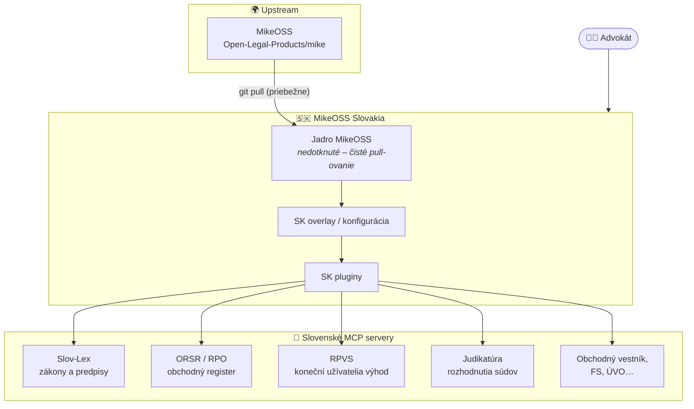
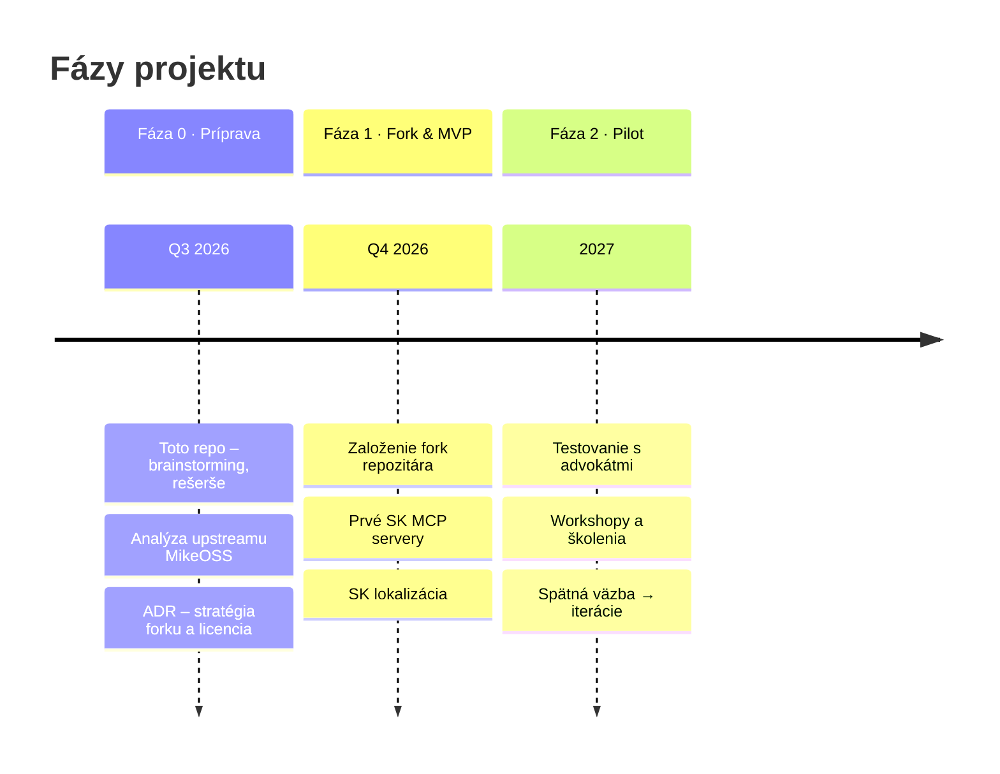
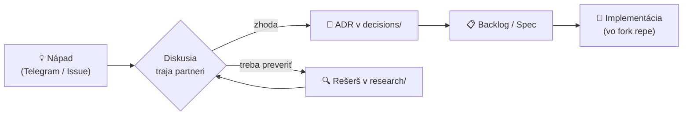

<div align="center">

# ⚖️ MikeOSS Slovakia

**Open-source právny asistent pre slovenských advokátov**
*Fork projektu [MikeOSS](https://github.com/Open-Legal-Products/mike), špecializovaný pre slovenské právo a jurisdikciu SR*

[](planning/roadmap.md)
[](https://github.com/Open-Legal-Products/mike)
[](LICENSE)
[](docs/vision.md)

</div>

> [!NOTE]
> Toto repo **zatiaľ neobsahuje kód forku**. Slúži na brainstorming, rešerše, plánovanie a spoločnú evidenciu podkladov (vrátane `AGENTS.md` / `CLAUDE.md`) pred založením samotného fork repozitára.

---

## 🎯 Vízia

Priniesť slovenským advokátom **užitočný open-source nástroj úplne zadarmo** — postavený na MikeOSS, obohatený o slovenské pluginy a MCP servery (Slov-Lex, ORSR, RPVS, judikatúra…), prispôsobený slovenskému právu, s možnosťou neskoršieho rozšírenia o ďalšie krajiny.

| | |
|---|---|
| 👥 **Tím** | Marián Čuprík · Martin Friedrich · Igor Ribár (advokáti SAK, pracovná skupina pre elektronizáciu advokácie) |
| 💰 **Model** | Nástroj zadarmo, open-source. Monetizácia výhradne cez workshopy a školenia. |
| 🔄 **Stratégia forku** | Slovenské úpravy ako pluginy/overlay vrstva → priebežné pull-ovanie upstream aktualizácií bez konfliktov |
| 💬 **Komunikácia** | Telegram skupina + GitHub Issues/Discussions |

## 🏗️ Architektúra forku (návrh)



## 🎨 Vizuálny koncept

Ranný náčrt značky a produktu — logo (monogram „M" s váhami spravodlivosti), tmavo-zlatá paleta, typografia **Inter + Playfair Display** a koncept dashboardu (Spisy · Klienti · Dokumenty · Fakturácia · AI Asistent). Päť pilierov: **dôvera a bezpečnosť · efektivita · prehľadnosť · spolupráca · modernosť**.

> Celý moodboard a rozpis: **[docs/brand-concept.md](docs/brand-concept.md)** · *(ide o koncept, nie schválený finálny dizajn)*

## 🗺️ Roadmapa



Detailný harmonogram: [planning/timeline.md](planning/timeline.md) · Backlog: [planning/backlog.md](planning/backlog.md)

## 📊 Progress

<!-- AUTO:PROGRESS -->
| Súbor | Progress | Hotovo |
|---|---|---|
| [`backlog.md`](planning/backlog.md) | `░░░░░░░░░░░░░░░░░░░░` | 0/5 (0 %) |
| [`roadmap.md`](planning/roadmap.md) | `██░░░░░░░░░░░░░░░░░░` | 2/17 (12 %) |
| [`workshopy.md`](planning/workshopy.md) | `░░░░░░░░░░░░░░░░░░░░` | 0/3 (0 %) |
<!-- /AUTO:PROGRESS -->

## 🗂️ Štruktúra repozitára

<!-- AUTO:TREE -->
```text
mikeOSS-SLOVAKIA/
├── assets/
│   └── brand/
│       └── README.md
├── decisions/
│   └── template.md
├── docs/
│   ├── brand-concept.md
│   ├── glossary.md
│   ├── principles.md
│   ├── telegram-notifikacie.md
│   └── vision.md
├── meetings/
├── planning/
│   ├── backlog.md
│   ├── roadmap.md
│   ├── timeline.md
│   └── workshopy.md
├── research/
│   ├── inspiracie/
│   ├── mcp-servery/
│   ├── mikeoss/
│   ├── pravny-ramec/
│   └── sk-datove-zdroje/
├── specs/
│   └── template.md
├── AGENTS.md
├── CLAUDE.md
└── README.md
```
<!-- /AUTO:TREE -->

<details>
<summary><b>Na čo slúžia jednotlivé priečinky</b></summary>

| Priečinok | Účel |
|---|---|
| `docs/` | Vízia, princípy, glosár |
| `decisions/` | ADR — zaznamenané rozhodnutia (čo, prečo, aké alternatívy) |
| `research/` | Rešerše: upstream MikeOSS, inšpirácie, SK dátové zdroje, MCP servery, právny rámec |
| `planning/` | Roadmapa, timeline, backlog, plán workshopov |
| `specs/` | Konkrétne návrhy funkcií (dozreté nápady z backlogu) |
| `meetings/` | Zápisky zo stretnutí (`RRRR-MM-DD.md`) |
| `assets/` | Diagramy, obrázky, PDF podklady |
| `AGENTS.md` | Kontext pre agentické systémy — **single source of truth** |
| `CLAUDE.md` | Mirror `AGENTS.md` — needitovať priamo |

</details>

## 🔄 Ako pracujeme s rozhodnutiami



## 📈 Aktivita

<!-- AUTO:ACTIVITY -->
**3 commitov** · **25 súborov**

| Commit | Dátum | Autor | Správa |
|---|---|---|---|
| `93354ef` | 2026-07-10 | Marián Čuprík | ci: Telegram notifikácie z GitHubu (push/release/issue/PR) + návod |
| `4cc9f8e` | 2026-07-10 | Marián Čuprík | docs: pridaný vizuálny koncept značky (moodboard, paleta, dashboard) |
| `eb79d33` | 2026-07-10 | Marián Čuprík | feat: prípravné repo — štruktúra, rich README s mermaid diagramami a auto-update workflow |
<!-- /AUTO:ACTIVITY -->

---

<div align="center">
<sub>Sekcie označené 🤖 sa aktualizujú automaticky GitHub Action pri každom pushi — needitujte ich ručne.<br/>
<b>Posledná automatická aktualizácia:</b> <!-- AUTO:UPDATED -->2026-07-10 09:30 UTC<!-- /AUTO:UPDATED --></sub>
</div>
