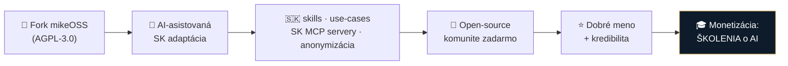

# ADR 0002: Prečo forkujeme mikeOSS (a ako)

- **Dátum:** 2026-07-10
- **Stav:** prijaté (na potvrdenie MF + IR)
- **Rozhodli:** MČ · *(čaká na potvrdenie: Martin Friedrich, Igor Ribár)*
- **Súvisí s:** [ADR 0001 — stratégia forku](0001-fork-strategy.md) · [deep research](../research/deep-research/)

> [!NOTE]
> Toto rozhodnutie vzniklo po deep researchi (245 zdrojov) a adverzariálnej oponentúre („roast"). Zaznamenávame ho, aby sme sa k nemu nevracali — vrátane **prečo NIE alternatívy**.

## Kontext

Traja advokáti (MČ, MF, IR; IR člen predsedníctva SAK) chcú slovenským advokátom priniesť užitočný AI nástroj. Kľúčové **obmedzenia**, ktoré určujú tvar riešenia:

- **Robíme to ako voľnočasovú aktivitu**, nie ako firmu. Adaptáciu pohá­ňa z veľkej časti AI → nízka náročnosť na development.
- **NEpredávame softvér ani službu (SaaS).** Akonáhle predávam službu, stávam sa poskytovateľom → zodpovednosť, servisná údržba, SLA. Preklopil by som sa z advokáta na predajcu softvéru — to nechceme (ohrozilo by výkon advokácie).
- **Monetizácia = vzdelávanie.** Nástroj je kredibilita a marketing; zarábame na školeniach o AI a o používaní nástroja, nie na kóde.
- **Open-source, nechané komunite.** Urobíme si dobré meno.

## Rozhodnutie

**Forkneme [mikeOSS](https://github.com/Open-Legal-Products/mike), AI-asistovane ho prispôsobíme pre SK (skills, use-cases, napojenie na naše existujúce SK MCP servery, anonymizácia), vydáme ako open-source a monetizujeme cez vzdelávanie — nie ako softvér ani službu.**



## Zvažované alternatívy (a prečo NIE)

| Alternatíva | Prečo NIE |
|---|---|
| **SaaS / predaj softvéru ako služby** | Stávam sa poskytovateľom → zodpovednosť, SLA, údržba. Preklopenie advokát → softvérový vendor. **Vylučuje sa s výkonom advokácie.** |
| **Len MCP + skills nad existujúcim klientom (bez forku)** | Technicky elegantné, ale netechnický advokát nerozbehne „naklonuj MCP config". Fork dáva **použiteľnú appku** s UI. |
| **Postaviť od nuly** | Niekto (mikeOSS/Stella) už cestu prešliapal robustne. Zbytočná práca. |
| **Fork Stelly namiesto mikeOSS** | Ostáva otvorené na porovnanie (viď nižšie) — Stella je z Česka, permisívnejšia licencia a už má anonymizáciu. |

## Prečo práve mikeOSS (overené fakty, nie dojem)

> Stav ku dňu 2026-07-10, overené cez GitHub API:

| Ukazovateľ | Hodnota | Interpretácia |
|---|---|---|
| Licencia | **AGPL-3.0** | share-alike; sedí s OSS zámerom (viď riziká) |
| Vznik | 2026-04-29 (~2,5 mes.) | mladý projekt |
| Popularita | **3 924 ⭐ · 1 238 forkov** | „známy" — ✅ pravda |
| Jadro | **3 prispievatelia · ~6 commitov/mesiac** | ⚠️ populárny ≠ dlho udržiavaný |

> [!WARNING]
> Argument „známy → preto bude dlho maintainovaný" je **slabý spoj**: 3-členné jadro a spomaľujúce tempo = riziko, že upstream o pol roka zamrzne. **Mitigácia:** keďže aj tak forkujeme a adaptujeme si to sami, na upstreame *nezávisíme* — „priebežné pullovanie" je bonus, nie základ. Rozhodnutie opierame o *„forkujeme, lebo si to prispôsobíme"*, nie o *„bude maintainované"*.

### mikeOSS vs Stella — porovnať pred zabetónovaním

| | **mikeOSS** | **Stella** |
|---|---|---|
| Pôvod | Will Chen (ex-Latham), US 🇺🇸 | Česko 🇨🇿 |
| Licencia | AGPL-3.0 *(overené)* | Apache-2.0 *(podľa rešerše — over)* |
| Anonymizácia | ❌ (treba doplniť) | ✅ už má (WASM) |
| Pre nás | základ appky | zdroj komponentov **alebo** alternatívny základ |

> [!IMPORTANT]
> **Faktická oprava:** mikeOSS **nie je z Česka**. Z Česka je **Stella** (a anonymizátor **MasKIT**). „Prebrať kopec vecí z Česka" = prebrať zo Stelly — ktorá je navyše permisívnejšia (Apache-2.0) a anonymizáciu už má. **Akcia:** 30-min porovnanie „mikeOSS + požičať anonymizáciu zo Stelly" vs „Stella ako základ" pred prvým commitom forku.

## Dôsledky a podmienky

Tri podmienky, ktoré platia **nezávisle** od biznis modelu:

```mermaid
flowchart TD
    D["Fork mikeOSS pre SK"] --> C1["1️⃣ Anonymizácia:<br/>chytá SK identifikátory<br/>(rodné číslo, IBAN, tituly)<br/>ALEBO honest disclaimer"]
    D --> C2["2️⃣ Optika SAK:<br/>transparentný vzťah<br/>(žiadne „odobrené komorou")"]
    D --> C3["3️⃣ Nezávislosť od upstreamu:<br/>forkujeme si to po svojom"]
    classDef r fill:#7c1d1d,stroke:#e4a; color:#fff
    class C1 r
```

1. **Anonymizácia je jadro — reputačné, nie servisné riziko.** AGPL disclaimer zbaví *právnej* zodpovednosti, ale budeme ľudí **učiť** nástroj používať a máme naň naviazané mená (vrátane IR/SAK). Ak niekoho naučíme dôverovať filtru, ktorý prepustí rodné číslo/IBAN, a vytečie mu to — žiadna licencia to nekryje. **Buď to naozaj chytá SK identifikátory, alebo to jasne predávame ako „asistenčné, vždy skontroluj — NIE záruka".** Sem patrí 80 % energie (MasKIT má diery: rodné čísla, IBAN, tituly; recall ~0,8).
2. **Optika SAK.** Monetizovať školenia, kým spoluautor sedí v predsedníctve komory, si niekto orámuje ako „insider". **Fix pred spustením:** transparentné priznanie vzťahu; nič v štýle „schválené komorou".
3. **AGPL-3.0 dôsledky.** Nikdy z toho nebude uzavretá komerčná verzia; ktokoľvek to hostí upravené, musí zverejniť zdroj. Obe **sedia** s naším OSS zámerom → nie je to blocker, len to vedome berieme.

## Najlacnejší test (pred forkom celej platformy)

> Rozhodne viac než celý roadmap.

Vezmi **jeden reálny spis** → prejdi ním **anonymizáciu + jednu Slov-Lex/judikatúra rešerš** (cez naše existujúce SK MCP servery) → over:
- [ ] ušetrí to advokátovi **≥ 1 hodinu**?
- [ ] **neprepustí ani jeden** citlivý údaj (rodné číslo, IBAN)?

Ak áno → forkujeme. Ak nie → vieme to skôr, než sme investovali.

## Ďalšie kroky

- [ ] 30-min porovnanie mikeOSS vs Stella ako základ ([research/inspiracie/](../research/inspiracie/))
- [ ] Over licenciu Stelly (Apache-2.0?)
- [ ] Najlacnejší test na 1 reálnom spise
- [ ] Potvrdenie ADR: MF, IR
- [ ] Rozhodnúť formu transparentnosti voči SAK
