# Vizuálny koncept — MIKE OSS Slovakia

> [!NOTE]
> Ide o **ranný vizuálny koncept / moodboard**, nie o schválený finálny dizajn. Slúži ako smerovanie značky a UI. Záväzné rozhodnutia o brandingu patria do [ADR](../decisions/).

## Moodboard

<!-- Nahrajte obrázok moodboardu do assets/brand/moodboard.png a zobrazí sa tu automaticky. -->

## Značka

<!-- Nahrajte logo do assets/brand/logo.png a zobrazí sa tu. -->

- **Názov:** MIKE OSS SLOVAKIA
- **Logo:** okrúhly odznak — monogram „M" v tvare koruny, so symbolom váh spravodlivosti hore a antickým stĺpom v strede; zlatá na tmavo-námorníckom podklade so zlatým lemom.
- **Claim v logu:** *KOMUNITA PRE ADVOKÁTOV*
- **Podtitul:** *Telegram komunita pre advokátov* — `t.me/mikeoss_slovakia`
- **Positioning:** *„Navrhnuté advokátmi pre advokátov"* — otvorená komunita advokátov a právnych profesionálov, ktorí zdieľajú vedomosti a moderné nástroje pre efektívnu právnu prax.

## Farebná paleta

| Farba | Použitie | Hex (orientačne) |
|---|---|---|
| Tmavá námornícka (navy) | Primárne pozadie, header | `#0D1B2A` |
| Zlatá | Akcent, logo, CTA | `#C9A24A` |
| Antracit / sivá | Sekundárne plochy | `#3A4553` |
| Svetlosivá | Karty, oddeľovače | `#D9DCE1` |
| Biela | Obsahové plochy, text | `#FFFFFF` |

## Typografia

- **Inter** — UI, telo textu (moderný, čitateľný sans-serif)
- **Playfair Display** — nadpisy, akcenty (dôveryhodnosť, „spojenie moderny a tradície")

## Dizajnová filozofia

Právna práca si zaslúži nástroje, ktoré šetria čas, znižujú chaos a prinášajú istotu. Päť pilierov:

| Pilier | Význam |
|---|---|
| 🛡️ **Dôvera a bezpečnosť** | Ochrana dát na najvyššej úrovni |
| ⚡ **Efektivita** | Automatizácia rutinných úloh |
| 🎯 **Prehľadnosť** | Všetko dôležité na jednom mieste |
| 👥 **Spolupráca** | Tímová práca a zdieľanie |
| 🌿 **Modernosť** | Technológie, ktoré posúvajú prax |

**Vizuálny jazyk:** minimalistický · profesionálny · zrozumiteľný · nadčasový

## Náčrt produktu (dashboard)

Koncept hlavného rozhrania — ľavý navigačný panel + prehľadový dashboard:

```mermaid
flowchart LR
    subgraph nav["Navigácia"]
        D["Dashboard"]
        S["Spisy"]
        U["Úlohy"]
        K["Kalendár"]
        KL["Klienti"]
        DOK["Dokumenty"]
        F["Fakturácia"]
        V["Výkazy času"]
        SAB["Šablóny"]
        AI["AI Asistent ᴮᴱᵀᴬ"]
    end
    subgraph dash["Dashboard – prehľad"]
        M1["Aktívne spisy"]
        M2["Úlohy na dnes"]
        M3["Fakturované / mesiac"]
        M4["Výkazy času / týždeň"]
        T["Aktuálne úlohy"]
        E["Nadchádzajúce udalosti"]
        R["Nedávne dokumenty"]
    end
    nav --> dash
```

**Kľúčové moduly:** Spisy · Úlohy · Kalendár · Klienti · Dokumenty · Fakturácia · Výkazy času · Šablóny · **AI Asistent** (analýza zmlúv, vyhľadanie relevantnej judikatúry).

> [!TIP]
> Moduly ako *Spisy*, *Klienti*, *AI Asistent* a *Šablóny* sú prirodzené miesta na napojenie slovenských MCP serverov (Slov-Lex, ORSR, RPVS, judikatúra) — pozri [backlog](../planning/backlog.md).
