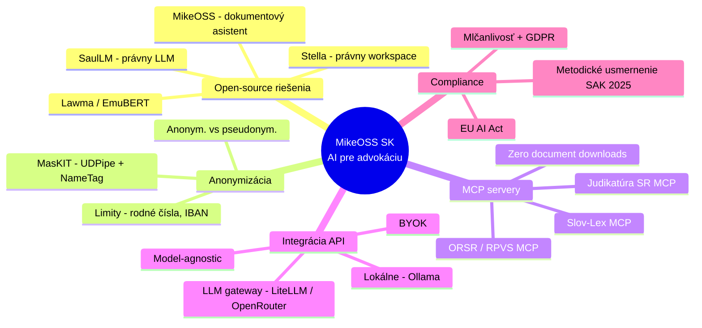
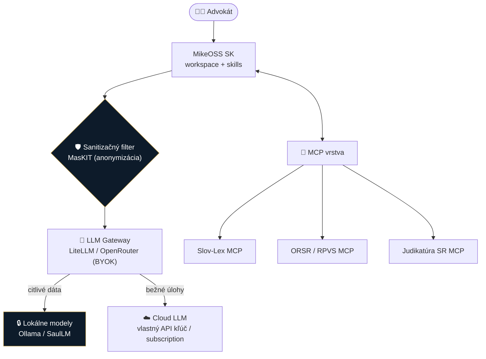
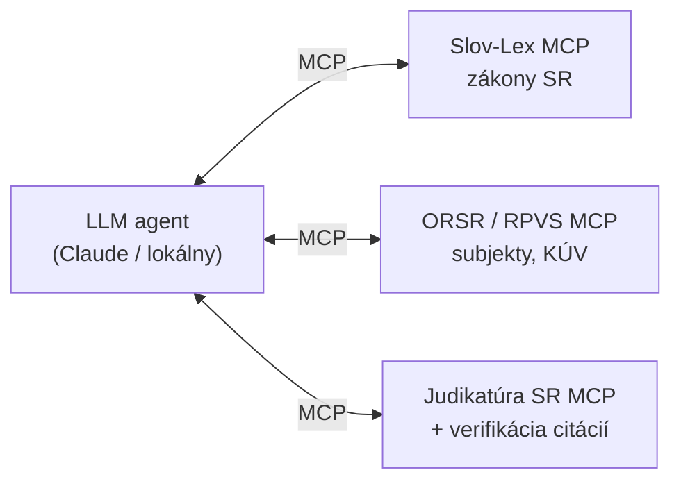
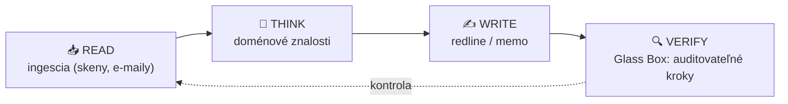
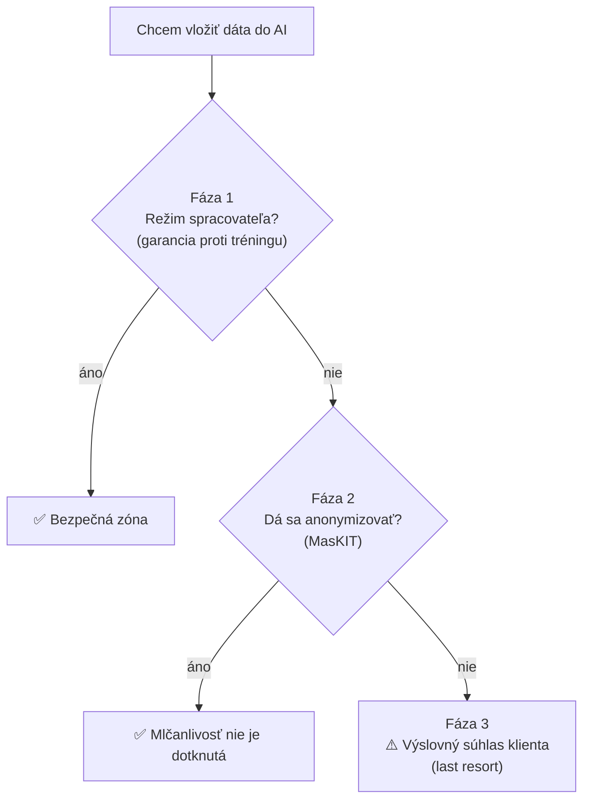

# 🔬 Deep Research: Open-source AI pre slovenskú advokáciu

**Podklad pre MikeOSS Slovakia** · NotebookLM deep research · 2026-07-10

> [!NOTE]
> Tento report je zakotvený do **245 webových zdrojov** nazbieraných v 6 deep-research kolách cez NotebookLM. Kľúčové projekty sú menované; kvalita jednotlivých zdrojov sa líši — pri projektoch označených ⚠️ over stav údržby priamo na GitHube pred zaradením.

## 📁 Obsah balíka

| Súbor | Čo to je |
|---|---|
| **[report.html](./report.html)** | Grafický HTML report *(živý cez GitHub Pages — link v repo README)* |
| [2026-07-10-open-source-legaltech-EU-mcp-anonymizacia.md](./2026-07-10-open-source-legaltech-EU-mcp-anonymizacia.md) | Pôvodný report z NotebookLM (SK) |
| [2026-07-10-zdroje.md](./2026-07-10-zdroje.md) | Zoznam všetkých 245 URL zdrojov |
| 🎧 Audio podcast (SK, deep-dive) | v **[GitHub Release](../../releases)** *(65 MB, mimo git histórie)* |
| 🧠 Mind-mapa | interaktívne v [NotebookLM notebooku](https://notebooklm.google.com/notebook/aba8a717-fa61-4c46-8bb8-a4f770b367a8) |

---

## 🧭 Mapa témy

## 🏗️ Odporúčaná hybridná architektúra

> [!IMPORTANT]
> Princíp **„zero document downloads"**: dáta ostávajú v pôvodnom úložisku, AI k nim cez MCP pristupuje len indexom a fragmentmi. To je jadro dátovej suverenity, na ktorej má fork stáť.

---

## 1️⃣ Open-source & EU riešenia (2025–2026)

> Zameranie: **aktívne udržiavané**, self-hostovateľné, s reléváciou pre EU/SK/CZ.

| Projekt | Funkcia | Licencia | EU / self-host | Stav |
|---|---|---|---|---|
| **MikeOSS** | Dokumentový asistent (chat s PDF) | Open Source | ✅ (S3/R2) | 🟢 aktívny |
| **Stella** | Open-source právny workspace | Open Source | ✅ (TypeScript) | 🟢 aktívny |
| **MasKIT** | Anonymizácia / pseudonymizácia | Open Source | ✅ (REST/local) | 🟢 aktívny (v0.70) |
| **SaulLM** | Špecializovaný právny LLM | MIT | ✅ | 🟢 aktívny |
| **Lawma** | Klasifikácia právnych úloh | Open Source | ✅ | 🟢 (Llama 3.2) |
| **EmuBERT** | Model pre regionálnu legislatívu | Open Source | ✅ | 🟢 (RoBERTa) |
| Sound Suite ⚠️ | Local-first indexácia & search | Polyform NC | ✅ (offline) | over na GitHube |
| adeu ⚠️ | Agentické redigovanie DOCX | Open Source | ✅ | over (MCP server) |
| pasal ⚠️ | RAG pre legislatívu | Open Source | ✅ | over (vzor pre SR) |

## 2️⃣ Anonymizácia — MasKIT (a čo si vziať zo Stelly)

**MasKIT** je najkonkrétnejší technický základ pre bezpečnú prácu s citlivým textom v SK/CZ:

- **Architektúra:** `UDPipe` (syntaktická analýza, Universal Dependencies) + `NameTag` (NER) → chápe gramatické vzťahy a presne identifikuje subjekty.
- **Režimy:** *anonymizácia* (údaj → abstraktná trieda, napr. `M-ZENA-MENO-1`, zachová štruktúru) vs *pseudonymizácia* (údaj → náhodné meno rovnakého typu, zachová pád a rod).
- **Známe limity ⚠️:** Recall ~0,8 / Precision ~0,64; **nedetekuje tituly, rodné čísla, IBAN, ID dátových schránok** → doplniť regex pravidlá + manuálnu kontrolu.

> [!TIP]
> Použi MasKIT ako **middleware „sanitizačný filter"** pred odoslaním do LLM — presne to rieši Stella integráciou pred-LLM čistenia.

## 3️⃣ MCP servery pre právo (lokálne aj remote)

- Už existujú prvé právne MCP servery (napr. `LegalMCP` pre US právo, 18 nástrojov).
- **Pre nás postaviť vlastné:** Slov-Lex MCP (sémantické vyhľadávanie v zákonoch), ORSR/RPVS MCP (verifikácia subjektov a vlastníckych štruktúr v reálnom čase), Judikatúra SR MCP (rozhodnutia + automatické overovanie citácií).

## 4️⃣ Agentické skills — čo sa dá automatizovať

Agentický loop zrkadlí prácu advokáta: **READ → THINK → WRITE → VERIFY**.

Typické úlohy zo zdrojov: kontrola a draft zmlúv (ACM/redline), due diligence nad množstvom dokumentov, extrakcia lehôt zo súdnych podaní, právne memá. **Glass-box princíp** = každý krok, citácia aj redakcia sú spätne dohľadateľné (kľúčové pre EU AI Act aj zodpovednosť advokáta).

## 5️⃣ Integrácia: subscription + vlastné API + lokálne API (BYOK)

- **LLM gateway** (`LiteLLM` / `OpenRouter`) ako centrálny bod s **BYOK (Bring Your Own Key)** — jedno miesto na kľúče, routing, náklady.
- **Lokálny hosting** (`Ollama`, prípadne právny `SaulLM`) pre najcitlivejšie dáta v lokálnej sieti.
- **Model-agnostic architektúra** — dynamické prepínanie modelu podľa citlivosti úlohy; vzor „AI za firewallom klienta" (lokálne spracovanie pred akýmkoľvek cloud prenosom).

## 6️⃣ Čo treba splniť — compliance

- **Metodické usmernenie SAK 2025:** advokát nesie plnú zodpovednosť za výstupy AI; pozor na *automation bias*.
- **EU AI Act:** transparentnosť a audit trail agentických krokov.
- **GDPR + mlčanlivosť:** dátová suverenita, self-hosting pri najcitlivejších dátach.

---

## ✅ Odporúčania pre MikeOSS Slovakia

1. **Local-first indexácia** — vyhľadávanie stavať tak, aby index vznikal lokálne/offline.
2. **Slov-Lex MCP wrapper** — vlastný konektor pre SK legislatívu, sémantické vyhľadávanie + verifikácia citácií.
3. **Sanitizačný filter (MasKIT)** medzi workspace a LLM, s doplnkovými regex pravidlami pre SK špecifiká (rodné čísla, IBAN).
4. **LLM gateway s BYOK** + lokálny fallback (Ollama) — model-agnostic od začiatku.
5. **Audit-ready logy** každého agentického kroku — splnenie EU AI Act aj SAK 2025.

Vygenerované z NotebookLM notebooku „MikeOSS SK — Research" (245 zdrojov). Over projekty označené ⚠️ pred zaradením do plánu.

